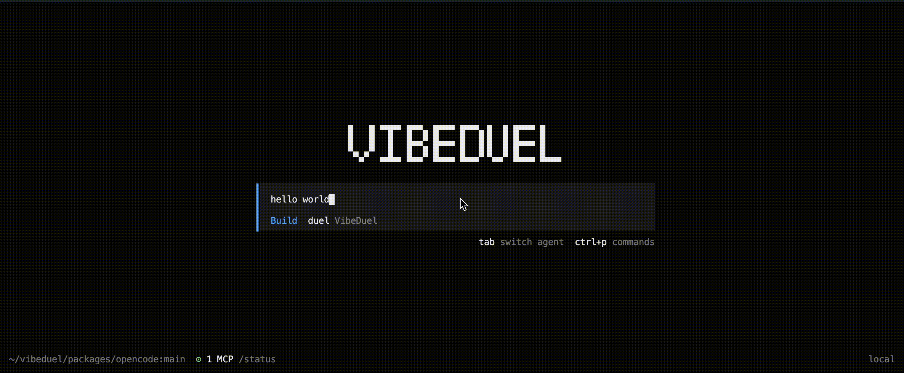

# VibeDuel

A community-driven AI coding assistant for your terminal. Fork of [OpenCode](https://github.com/anomalyco/opencode), powered by VibeDuel — giving you access to the best coding LLMs for free.



## Installation
### Quick start

```bash
curl -fsSL https://vibeduel.ai/install | bash
vibeduel
```

### For development

```bash
git clone https://github.com/vibeduel-project/vibeduel.git
cd vibeduel
bun install
bun dev
```

## How it works

The difference between VibeDuel and other coding agents like OpenCode is duel mode. In duel mode, two agents work independently side-by-side. When they're done, you vote for the better agent. 
Vote in duel mode to get credits to spend in single-model mode. Single-model mode is an identical experience to other coding agents. 


### Use single-model mode
Enter `/models` and pick your favorite model. 
Each request costs **1 credit**.

### Use duel mode
Press `shift+tab` or pick `duel` in the model picker. You can switch to duel mode at any time. 
Each vote gives **50 credits** and goes to the leaderboard.

## Uninstall
```bash
curl -fsSL https://vibeduel.ai/uninstall | bash
```